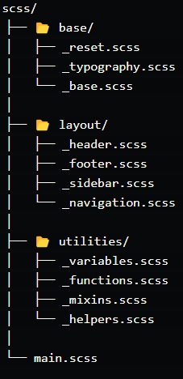

# [Sass](https://sass-lang.com/)

SASS is a CSS preprocessor compatible with all versions of CSS. It is therefore a tool used by web developers to translate non-standard stylesheet code into standard CSS code, readable by most browsers.

```bash
npm install -g sass -D
```

## Table of Content

- [Variables](#variables)
- [Mixins](#mixins)
- [Modules](#modules)
- [Folder structure](#folder-structure)

## [Variables](/Sass/variables.scss)

The way to declare a variable in sass is as
follows. `$<variable>:<value>`

```scss
$main: #ccc;
```

### Array of variables

It is a way of declaring multiple variables

```scss
$colors: (
  'white': #fff,
  'purple': #770af4,
);
```

## [Mixins](/Sass/mixins.scss)

A mixin is like a “function” in the sense that it allows us to reuse code and that it accepts arguments. The characteristic of mixins is that they define properties that are then included in a selector.

```scss
@mixin name {
  property: value;
  ...
}
```

### Mixins with variables

```scss
@mixin max-width($width) {
  max-width: $width;
  margin: auto;
}
```

## Modules

Sass provides many built-in modules that contain useful functions (and the occasional combination). These modules can be loaded with the @use rule like any user-defined style sheet, and their functions can be called like any other module member.

```scss
@use '_mixins' as *;

div {
  @include flexBox(column, nowrap, normal, normal);
}
```

## Folder structure



- 📂 base/: It contains the basic styles, including normalization, typography and base styles.

- 📂 layout/: It includes the styles for the main structural sections such as the header, footer, among others.

- 📂 utilities/: It hosts helpers such as variables, functions and mixins that make writing CSS easier.

- 📄main.scss: It imports all partial files and is the entry point for the compilation.

[🡨 Back](../README.md)
